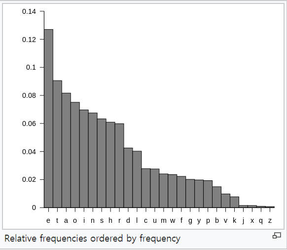

# 1. Introduction

#### Private Key Cryptography
- Relied exclusive on secret information (a key) shared between the communicating parties
- a.k.a secret-key, shared-key, symmetric-key cryptography
    - ex) save encrypted contexts in personal laptop.
- A private-key encryption scheme is defined by a message space __M__ and algorithms (Gen, Enc, Dec):
    - Gen (Key-generation algorithm): generates _k_
    - Enc (Encryption algorithm algorithm): c <- Enck(m)
        - takes key _k_ and message _m_ in __M__ as input
        - outputs ciphertext _c_
    - Dec (Decryption algorithm): m:=Deck(c)
        - takes key k and ciphertext c as input
        - outputs m or "error"

- For all m in M and k output by Gen, 
    &nbsp;&nbsp; Deck(Enck(m)) = m

#### Kerckhoffs's Principle
- Encryption scheme is not secret
    - The only secret is the key
    - The key must be chosen at random, kept secret

#### Sufficient Key Space Principle
- The __key space__ should be large enough to prevent "brute-force", exhaustive search attacks.
- But this does not guarantee secrecy.

 

## **History of Cryptography**
---

**Shift Ciphers**: shift every letter of the plantext by k positions
- M = {strings over lowercase English Alphabet}
- Gen: choose uniform _k_ in {0,...,25}
- Enck(m1...mt):= c1...ct, where ci := [mi + _k_ mod 26]
- Deck(c1...ct):= m1...mt, where mi := [ci - _k_ mod 26]

[**Caesar Cipher**](https://en.wikipedia.org/wiki/Caesar_cipher) (no key)
- shift plaintext by three. ex) a -> d, b -> e, c -> f
- The *key space* of this cipher is 26! so around 2^88. This in
itself is actually ok, but NOT SECURE
    - We can easily break the code by analyzing [letter frequency](https://en.wikipedia.org/wiki/Letter_frequency):
    - We know that "e" is the most frequent letter in the English
        language at around 12.7%. Therefore the most frequent letter
        in the ciphered text is likely to be "e".
    
    - After individual letters we can move to the frequency of
        letter pairs (diagrams)
    - This scheme is very weak because we only need access to the
        ciphertext in order to crack it.

**[Vigenere cipher](https://en.wikipedia.org/wiki/Vigen%C3%A8re_cipher)** (16th century)
- You choose a key and repeat it over the length of the message.
Then you add the (+ mod 26) of the two letters together (so
once you go over Z you start at A again) and thus you get your
ciphertext.
- Key is now a string, not just a character
- Size of key space?
    - If keys are 14-character strings, the key space has size 2614 ~ 266
    - Brute-force search expensive/impossible

- Is it Secured?
    - No.
    - Attacking the Vengenere Cipher (a way)
        - Assume a 14-character key.
        - Observe that every 14th character is "encrypted" using the same shift.
        - Using plaintext letter frequencies
            - eg. e is the most commonly used letter in plaintext
        - Guess the first character of the key is (alpha - 'e') and repeat

**[Rotor Machines](https://en.wikipedia.org/wiki/Rotor_machine)** (first mechanical form of cryptography) (1870-1943)
- The key is a rotor in a machine that rotates, thus creating a new key map for each key press.
- Early example: the Hebert machine
- The most famous example: The Enigma
- Also breakable with cipher-only attacks.

**[Data Encryption Standard](https://en.wikipedia.org/wiki/Data_Encryption_Standard)** (1974)
    - The government established a standard for encryption
    - DES uses 2^56 keys with block size of 64 bits, which while
    sufficient when it was introduced, should not be used in
    todays world because it's past its days.
    - Today we have AES (2001), Salsa20 (2008) and others

 

## **Attack on "Variant" Vigenere Cipher**
---

- Easier to work with ASCII plaintext and hex ciphertext.
    - The key is a string of bytes.
    - The plaintext is a string of ASCII characters.
- Easier to work with byte-wise XOR rather than modular addition.
    - To encrypt, XOR each character in plaintext with the next character of the key.
- Ex) Plaintext = "Hello!", key is 0xA1 2F
    - "Hello!" = 0x48 65 6C 6C 6F 21
    - key      = 0xA1 2F A1 2F A1 2F
    - cipher   = 0xE9 4A CD 43 CE 0E

- Attack: Time(Determine all bytes of the key) ~ 2562L, where L is the key length
    1. Determine the key length
        - Let pi (for 0<=i<=255) be the frequency of byte i in P.T.
            - ex) p97 = frequency of 'a'
            - The distribution is far from uniform.
        - If the key length is N, every Nth character of the P.T is encrypted using same "shift"
            - If take every Nth character and calculate frequencies, we should get pi's in permuted order
            - If take every Mth(not multiple of N) character and calculate frequencies, we should get something close to uniform

        - Compute some candidate distribution sum(qi2). Try all possibilities for the key length, compute distribution and look for maximum value.
            - If close to uniform, ~1/256
            - If a permutation of pi, then much larger than 1/256

    2. Determine each byte of the key
        - Look at every Nth character of C.T, starting with the ith character.
        - Try decrypting the stream using every possible byte value B.
            - If correct, a ll bytes in the P.T. will be between 32 and 127.
            - The frequencies of lowercase ltters should be close to knwon English-letter frequencies
                - Should find sum(piqi) =~ sum (pi2) =~ 0.065

